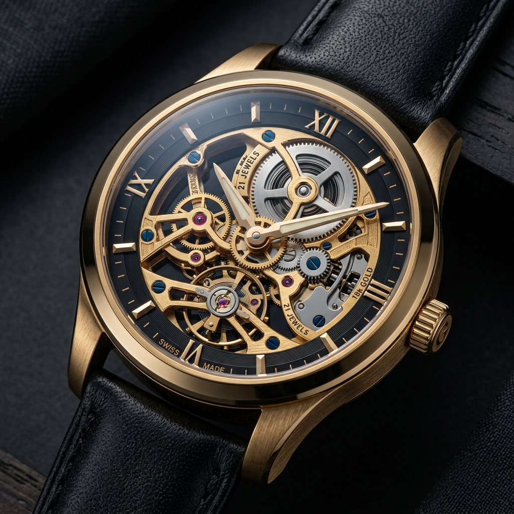

# Lal Times — 3D Watch Store

> *A premium, single-page luxury watch website featuring a 3D scroll-based animation and editorial design aesthetics.*



---

## ✨ Overview

**Lal Times** is a high-end, luxury watch brand website crafted with meticulous attention to detail. The site combines a cinematic 3D scroll-based hero section with an editorial, lookbook-style layout to deliver an immersive premium digital experience — reminiscent of the world's finest horology brands.

---

## 🎯 Features

- **3D Scroll Animation** — A 240-frame canvas-based 3D watch render that animates as the user scrolls, creating a cinematic, Apple-style storytelling experience.
- **Editorial Layout** — Asymmetrical, overlapping sections inspired by luxury watch editorial magazines.
- **Ambient Boutique Lighting** — Subtle radial gold glows and background noise textures that simulate the atmosphere of a high-end physical boutique.
- **Glassmorphism Cards** — Translucent display cases for watch collections with subtle metallic borders that glow on hover.
- **Scroll-Reveal Animations** — Custom `IntersectionObserver`-based reveal effects for all section content.
- **Luxury Footer** — Multi-column footer featuring global boutique cities, service links, and a live "Atelier Status: Online" indicator.
- **Fully Responsive** — Optimised across desktop and mobile viewports.

---

## 🗂️ Project Structure

```
3d Proj/
├── index.html          # Main single-page application
├── README.md           # Project documentation
├── assets/
│   ├── hero.png        # Hero watch product image
│   ├── collection1.png # Collection watch image
│   └── movement.png    # Mechanical movement close-up
└── Images 3d/
    ├── ezgif-frame-001.png
    ├── ezgif-frame-002.png
    ├── ...
    └── ezgif-frame-240.png  # 240 sequential 3D animation frames
```

---

## 🛠️ Tech Stack

| Technology | Usage |
|---|---|
| **HTML5** | Page structure & semantic markup |
| **Tailwind CSS** (CDN) | Utility-first styling |
| **Vanilla JavaScript** | Scroll animation engine, IntersectionObserver |
| **HTML Canvas API** | 240-frame 3D watch rendering |
| **Google Fonts** | Playfair Display (serif) + Inter (sans) |
| **SVG Filters** | Background noise grain texture |

---

## 🎬 3D Scroll Animation

The hero section uses a custom **canvas-based frame sequencer** to simulate a 3D product viewer. It works by:

1. Pre-loading all 240 PNG frames into an image cache.
2. Listening to the window `scroll` event inside a `600vh` tall sticky container.
3. Mapping the scroll progress (`0–100%`) to a frame index (`0–239`).
4. Rendering each frame to the `<canvas>` using `drawImage()` on `requestAnimationFrame`.

```js
// Core animation logic
function updateUI() {
    const scrollProgress = scrollTop / maxScroll;
    const frameIndex = Math.min(
        totalFrames - 1,
        Math.ceil(scrollProgress * totalFrames)
    );
    renderFrame(frameIndex);
}
```

---

## 🚀 Getting Started

No build step required. Simply clone the repo and open `index.html` in your browser.

```bash
git clone https://github.com/nerajlal/3D-WatchStore.git
cd 3D-WatchStore
open index.html
```

> **Note:** For the best experience, view the site in a modern Chromium-based browser (Chrome, Edge, Arc).

---

## 📐 Design System

| Token | Value | Usage |
|---|---|---|
| `brand-gold` | `#C5A059` | Primary accent, headings, borders |
| `brand-charcoal` | `#0A0A0A` | Base background |
| `brand-ivory` | `#F5F5F5` | Body copy |
| `Playfair Display` | Serif | Headings & editorial text |
| `Inter` | Sans | Navigation & body copy |

---

## 🌍 Boutique Locations

Lal Times maintains a fictitious global presence, with boutiques in:

**Geneva · Paris · Dubai · New York · Tokyo · London**

---

## 📄 License

This project is for portfolio and demonstration purposes.

---

<p align="center">
  <em>Lal Times Ateliers — Est. 1892, Geneva</em><br>
  <strong>Every second, perfected.</strong>
</p>
